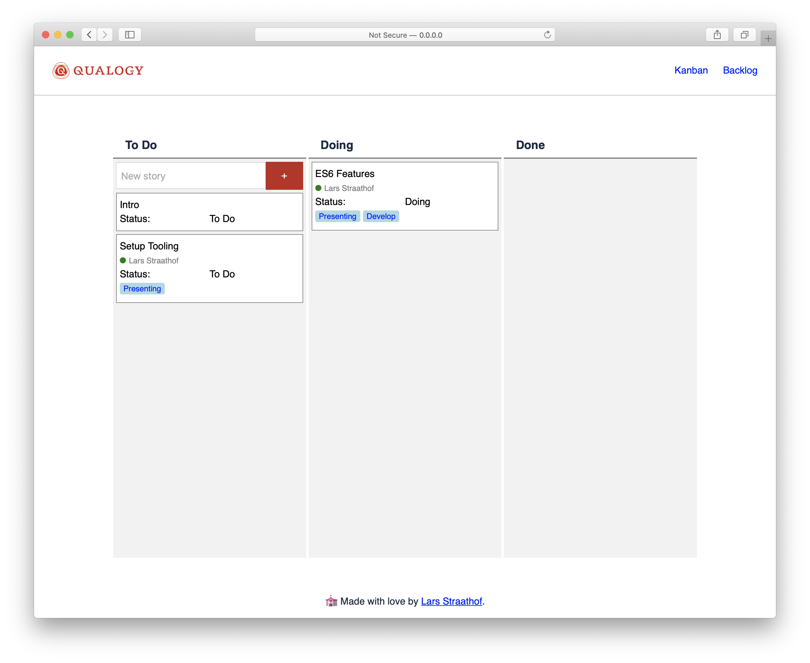

# Modern Javacript - Qualogy Workshop
Keeping up in the JavaScript world 🏃‍

#### Prerequisites
Have Node / NPM installed https://nodejs.org/

## Presentation
To view the presentation, download or clone this git repository. Then open the presentation folder with your Terminal or Command line tool. Run the command ``` npm i```, this will install the dependencies to run the presentation. When the installation is done run ``` npm run present```.

## Example application
The example application from the presentation can be found in the folder ***qualogy-scrum**. To install and run this web application open the folder in your Terminal or Command line tool and run ```npm i```. Then after installation run ```npm run start```.
Your browser should open with the application running. If not, open http://127.0.0.0.1:5000




The the example app Qualogy Scrum as a reference to learn more about JS ES6 and Lit-Element.
For demo purpose the app was not build in the best way possible. In future workshops we will improve the app.

## Exercices
The 2 exercises from the workshop can be found in the folder 'Excercises' under 1.md and 2.md.


### [Qualogy](https://www.qualogy.com/)