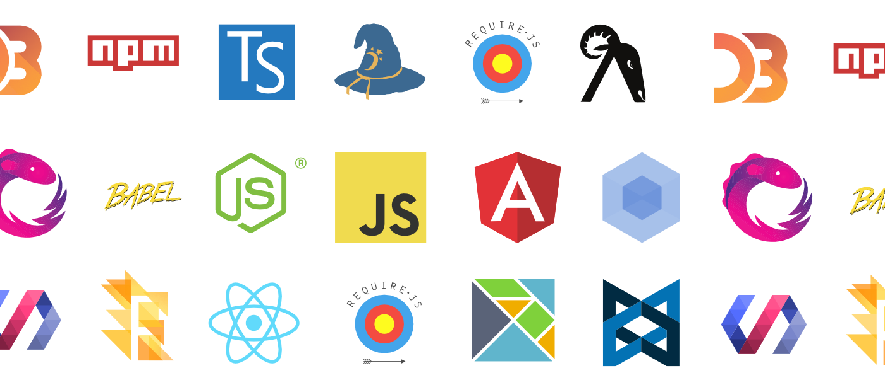
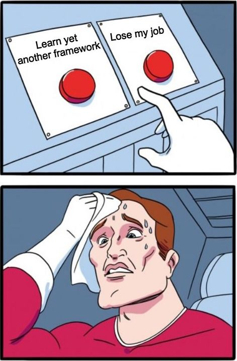
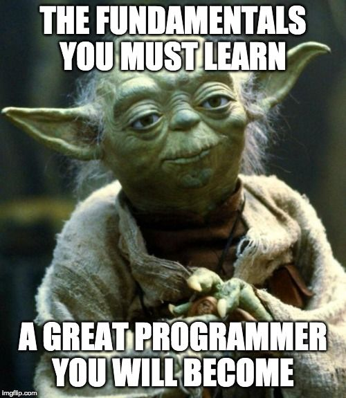
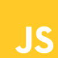
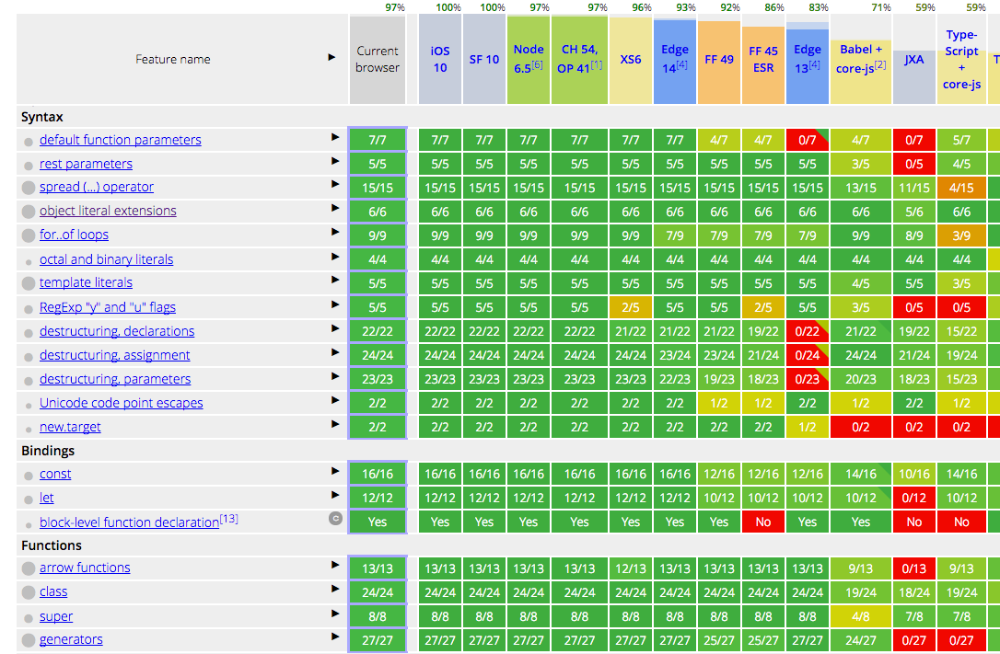
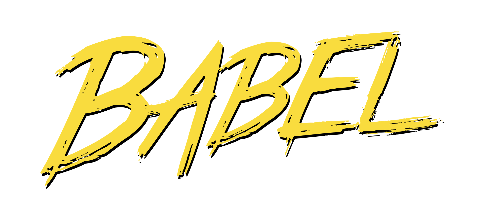
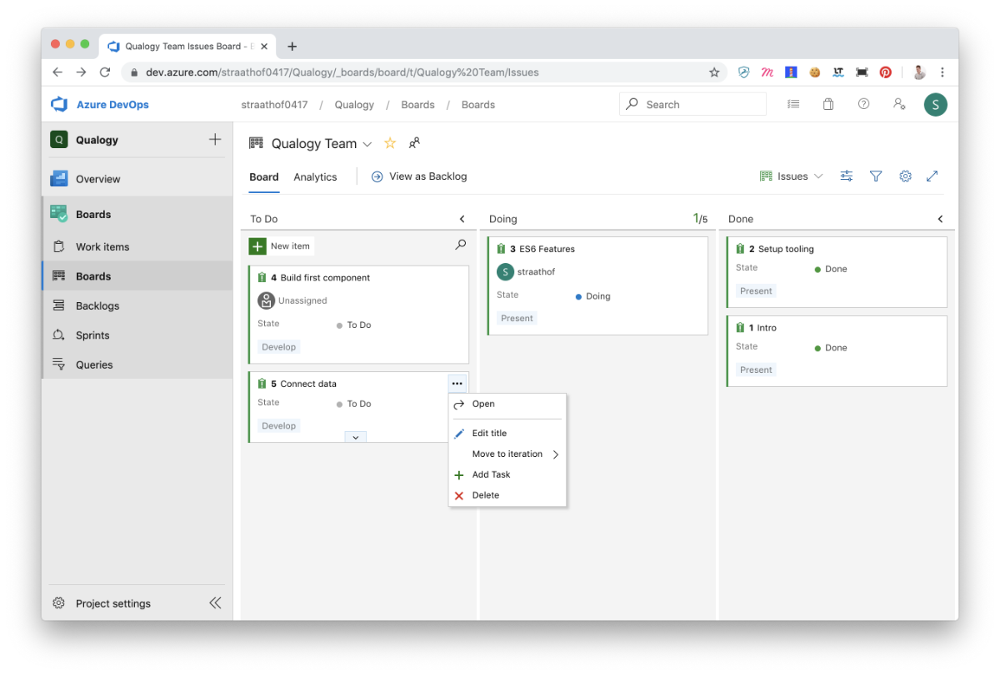
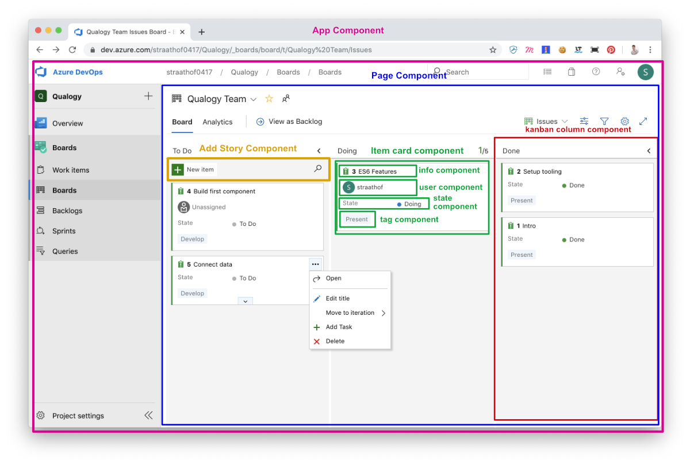
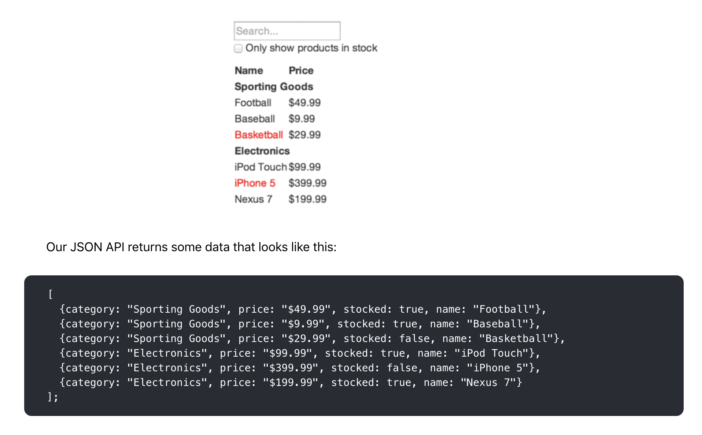
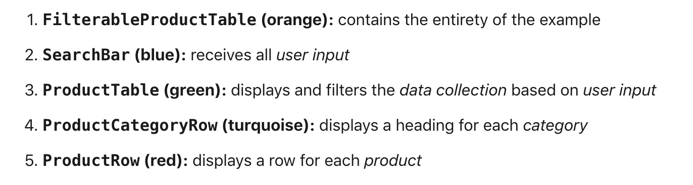

import { Split, FullScreenCode, Horizontal } from 'mdx-deck/layouts'
import { highlight } from 'mdx-deck/themes'
import {  Notes } from 'mdx-deck'
import SyntaxHighlighter from 'react-syntax-highlighter';

 
 
<h2>Modern JavaScript</h2>
<h4 style={{verticalAlign: 'middle', textAlign: 'center'}}>Keeping up in the JavaScript world 🏃‍♂️</h4>
<h4>By Lars Straathof</h4>
19-11-2019, Amsterdam

---
  ## Prerequisites
  
Have Node / NPM installed <a href="https://nodejs.org/">https://nodejs.org/</a>

  
Have Visual Studio Code installed <a href="https://code.visualstudio.com/">https://code.visualstudio.com/</a>

  
<i>Backup</i> <a href="https://codesandbox.io/">https://codesandbox.io/</a>

---

  ## Follow along
  
Notes <a href="https://repl.it/@larsamsterdam/modern-js">https://repl.it/@larsamsterdam/modern-js</a>

---

#### Where to start? 😮

---

#### New things 🤯

---

#### Relax 

---

 

---

export default Split

## Modern JavaScript

<ol style={{textAlign: '1left'}}>
  <li>👋 Intro</li>
  <li>🏛 History</li>
  <li>🛠 Setup tooling</li>
  <li>👨‍💻 ES6 (ES2015)</li>
  <li>💻 Exercise</li>
  <li>💡 Component Thinking</li>
  <li>🏗 Lets build</li>
  <li>🎁 Bonus</li>
</ol>

---

export default Split

  <h2>1. Intro</h2>

  <h4>About me</h4>
  <h3>Lars Straathof</h3>
  
<strong>Senior Front-end Developer</strong> 
  QC Working @ ING

  <small><a href="mailto:lstraathof@qualogy.com">lstraathof@qualogy.com</a></small> 
  <small><a href="mailto:mail@lars.amsterdam">mail@lars.amsterdam</a></small> 
  <h2>🏡 💻 🏋️‍♂️ 👨‍👩‍👧 🍺</h2>

---

## How does JavaScript fit in your work?

---

### 📦 Web / Mobile / IoT?
### 💯 Used for your product
### 🛠 Used as build tooling?
### 🖥 JavaScript on the server?

---

---

export default Split

JavaScript was first created by <strong>Brendan Einch</strong> at Netscape in 1995; it was nicknamed Mocha during development, and ultimately named JavaScript to piggyback on the popularity of Java.

---

 
 
 
 
 
<small><small>(ECMA = European Computer Manufacturers Association)</small></small>

---

## TC39 - ECMAScript
#### Maintaining the standard

---

## TC39 Proposal process 🤓
* Strawman
* Proposal
* Draft
* Candidate
* Finished

https://tc39.github.io/process-document/

---

## ES6 Features 🚀

* let and const
* => Functions
* Destructuring
* Looping
* Classes
* Modules

http://es6-features.org/

---

#### Browser support

---

# Modern Tooling 🛠

---

## How to use the future today?  🤖

---

https://babeljs.io/

---

  <h5>Demystify Babel</h5>
  <SyntaxHighlighter language="javascript">
  {`
  const hello = name => \`Hi, \${name}!\`;  
  `}
  </SyntaxHighlighter>
  Returns
  <SyntaxHighlighter language="javascript">
    {`
  var hello = function hello(name) {  
    return "Hi, " + name + "!";
  };
  const test = '';
  `}
  </SyntaxHighlighter>

---

## Presets 👉 📦 🔌

* es2015
* es2016
* es2017
* latest
* react
* flow
* typescript

---

### Custom settings

<SyntaxHighlighter language="javascript">{`
  module.exports = {
    presets: [
      require('babel-preset-es2015'),
    ],
    plugins: [
      [require('babel-plugin-transform-es2015-template-literals')],
      require('babel-plugin-transform-es3-member-expression-literals'), 
    ],
  };
  
`}</SyntaxHighlighter>

// Presets can contain other presets, and plugins with options.

---

### Example

<SyntaxHighlighter language="javascript">{`
  module.exports = function({types: t}) {
    return {
      visitor: {
        CallExpression(path, state) {
          if (path.get("callee").matchesPattern("console", true)) { 
            path.remove();
          }
        }
      }
    };
  }
  
`}</SyntaxHighlighter>

// Remove all calls to console.

---

## Lets setup our environment 💻
  Or codesandbox if installing npm failed  

---

### The NPM way

<SyntaxHighlighter language="javascript">{`
  // Go to the root of your new project in the terminal 
  // Run:
  
  npm init -y
`}</SyntaxHighlighter>

---

### Result: package.json

<SyntaxHighlighter language="javascript">{`
  {
    "name": "qualogy-scrum",
    "version": "1.0.0",
    "description": "",
    "main": "index.js",
    "scripts": {
      "test": "echo \"Error: no test specified\" && exit 1" 
    },
    "keywords": [],
    "author": "",
    "license": "ISC"
  }
  
`}</SyntaxHighlighter>

---
#### Install babel and webpack

<SyntaxHighlighter language="javascript">{`
  // Run:
  npm install --save-dev babel-loader @babel/core
  npm install --save-dev webpack webpack-cli webpack-dev-server 
`}</SyntaxHighlighter>

https://webpack.js.org/

---

#### Setup project structure

<SyntaxHighlighter language="json">{`
    |- package.json 
  + |- .babelrc
  + |- webpack.config.js
  + |- /dist
  +   |- index.html
  + |- /src
  +   |- app.js
`}</SyntaxHighlighter>

---

#### dist/index.html

<SyntaxHighlighter language="html">{`
  <!doctype html>
  <html>
    <head>
      <title>sQrum - we got your back'log</title> 
    </head>
    <body>
      
    </body>
  </html>
`}</SyntaxHighlighter>

---

#### webpack.config.js

<SyntaxHighlighter language="javascript">{`
  const path = require('path');
  module.exports = {
    entry: \'./src/app.js\',
    output: {
      filename: \'app.js\',
      path: path.resolve(__dirname, \'dist\'),
    },
  };
`}</SyntaxHighlighter>

---

#### Let's extend webpack with babel

<SyntaxHighlighter language="javascript">{`
  module.exports = {
    entry: \'./src/app.js\',
    output: {
      filename: \'app.js\',
      path: path.resolve(__dirname, \'dist\'),
    },
    module: {
      rules: [
        { test: /\\.js$/, exclude: /node_modules/, loader: "babel-loader" }
      ]
    }
  };
`}</SyntaxHighlighter>

---

#### Create .babelrc configuration file

<SyntaxHighlighter language="javascript">{`
  // in terminal
  npm install @babel/preset-env --save-dev
`}</SyntaxHighlighter>

<SyntaxHighlighter language="javascript">{`
// .babelrc file
{
  "presets": ["@babel/preset-env"]
}
`}</SyntaxHighlighter>

---

#### Configure npm package.json

<SyntaxHighlighter language="json">{`
  "scripts": {
    "test": "echo \"Error: no test specified\" && exit 1",
    "start": "webpack-dev-server --watch-content-base 
              --content-base dist --open --port 9010 --host 0.0.0.0",
    "build": "webpack"
  },
`}</SyntaxHighlighter>

add the "start" and "build" triggers under scripts

---

<SyntaxHighlighter language="javascript">{`
// Let's go! - in terminal
npm run start
`}</SyntaxHighlighter>

---

Nice, local dev env. is setup 🎇

---

# Lets talk ES6 🌟

---

## Block scope variables

With ES6, we went from declaring variables with **var** to use **let/const**.

---

### hoisting

<SyntaxHighlighter language="javascript">
{`var x = \'outer\';
function test(inner) {
  if (inner) {
    var x = \'inner\'; // scope whole function
    return x;
  }
  return x; // gets redefined because line 4 declaration is hoisted
}
test(false); // undefined 😱
test(true); // inner
`}</SyntaxHighlighter>

<small>For test(false) you would expect to return outer, BUT NO, you get undefined.</small>

---

<SyntaxHighlighter language="javascript">
{`let x = 'outer';
function test(inner) {
  if (inner) {
    let x = \'inner\';
    return x;
  }
  return x; // gets result from line 1 as expected
}
test(false); // outer
test(true); // inner
`}</SyntaxHighlighter>

<small>ES6 to the rescue</small>

---

### var

<SyntaxHighlighter language="javascript">
{`
  var x = 1;
  if( true ) {      
    var x = 2;
  }
  console.log(x); // 2      
`}</SyntaxHighlighter>

---

### let

<SyntaxHighlighter language="javascript">
{`
  let x = 1;
  if( true ) {      
    let x = 2;
  }
  console.log(x); // 1   
  x = 2;
  console.log(x); // 2   
`}</SyntaxHighlighter>

---

### const

<SyntaxHighlighter language="javascript">
{`
  const x = 1;
  if( true ) {      
    const x = 2;
  }
  console.log(x); // 1    
  x = 2; // Error: "x" is read-only
`}</SyntaxHighlighter>

---

### Template Literals

<small>We don’t have to do more nesting concatenations when we have template literals. Take a look:</small>

<SyntaxHighlighter language="javascript">
{`  // ES5
  var company = 'ING';
  var product = 'Touchpoint Platform';
  console.log('I currently work for ' + company + ' on ' + product + '.');
`}</SyntaxHighlighter>

<SyntaxHighlighter language="javascript">
{`  // ES6
  const company = 'ING';
  const product = 'Touchpoint Platform';
  console.log(\`I currently work for \${company} on \${product}.\`);
`}</SyntaxHighlighter>

---

### Destructuring Arrays

<small>Getting elements from an arrays</small>

<SyntaxHighlighter language="javascript">
{`  // ES5
  var array = [1, 2, 3, 4];
  var first = array[0];
  var third = array[2];
  console.log(first, third); // 1 3
`}</SyntaxHighlighter>

<SyntaxHighlighter language="javascript">
{`  // ES6
  const array = [1, 2, 3, 4];
  const [first, ,third] = array;
  console.log(first, third); // 1 3
`}</SyntaxHighlighter>

---

### Destructuring Objects

<small>Getting elements from an objects</small>

<SyntaxHighlighter language="javascript">
{`  // ES6
  const { company, product } = {
    company: 'ING',
    product: 'Touchpoint Portal',
    startDate: new Date('2019-01-02')
  }
  console.log(company, product); // ING Touchpoint Portal
`}</SyntaxHighlighter>

---

### Destructuring deep Objects

<small>Getting deeper elements from an objects</small>

<SyntaxHighlighter language="javascript">
{`  // ES6
  const { location: { street } } = {
    company: 'ING',
    product: 'Touchpoint Portal',
    startDate: new Date('2019-01-02'),
    location: {
      street: 'Streetname',
      number: '1',
    }
  }
  console.log(street); // Streetname
`}</SyntaxHighlighter>

---

### Arrow functions are 🔥 

<SyntaxHighlighter language="javascript">
{`  // ES5
  var fakeFunction = function() {
    console.log('fake function');
  };
  fakeFunction(); // fake function
`}</SyntaxHighlighter>

<SyntaxHighlighter language="javascript">
{`  // ES6
  const fakeFunction = () => console.log('fake function');
  fakeFunction(); // fake function
`}</SyntaxHighlighter>

---

### Arrow functions scope

<SyntaxHighlighter language="javascript">
{`
  // ES5
  var fakeFunction = function() {
    console.log(this);
  }
  fakeFunction(); // undefined
`}</SyntaxHighlighter>

<SyntaxHighlighter language="javascript">
{`
  // ES6
  const secondFakeFunction = () => console.log(this);
  secondFakeFunction(); // window object
`}</SyntaxHighlighter>

<small>**this** inside an arrow function refers to the context outside the function.</small>

---

### Default parameters 🎛

<SyntaxHighlighter language="javascript">
{`  // ES6
  const fakeFunction = (param1 = 'Hello', param2 = 'World') => {
    console.log(param1, param2);
  };
  fakeFunction(); // Hello World
`}</SyntaxHighlighter>

---

### Shorthand Coding 🤚

<SyntaxHighlighter language="javascript">
{`  // ES5
  const x = 20;
  let answer;
   
  if (x > 10) {
      answer = "greater than 10";
  } else {
      answer =  "less than 10";
  }
`}</SyntaxHighlighter>

<SyntaxHighlighter language="javascript">
{`  // ES6
  const answer = x > 10 ? "greater than 10" : "less than 10";
`}</SyntaxHighlighter>

---

#### Shorthand Coding 2 🤚

<SyntaxHighlighter language="javascript">
{`  // ES5
  if (variable1 !== null || variable1 !== undefined || variable1 !== '') {
    let variable2 = variable1;
  }
`}</SyntaxHighlighter>

<SyntaxHighlighter language="javascript">
{`  // ES6
  const variable2 = variable1  || 'new';
`}</SyntaxHighlighter>

---

### Spread operator 🍴

<SyntaxHighlighter language="javascript">
{`  // ES6
  const array1 = [2,100,1,6,43];
  const array2 = ['a', 'b', 'c', 'd'];
  const array3 = [false, true, null, undefined];
 
  console.log([...array1, ...array2, ...array3]);
`}</SyntaxHighlighter>

---

### Spread operator in React ⚛️

<SyntaxHighlighter language="javascript">
{`
  function App() {
    return <Hello firstName="Lars" lastName="Straathof" />;
  }
`}</SyntaxHighlighter>

<SyntaxHighlighter language="javascript">
{`
  function App() {
    const props = {firstName: 'Lars', lastName: 'Straathof'};
    return <Hello {...props} />;
  }
`}</SyntaxHighlighter>

---

## Map 🗺️ Filter 🥅 Reduce ✂️
The perfect toolset for your venture in Functional Programming

---

### Map 🗺️
The map() method creates a new array with the results of calling a provided function on every element in the calling array.

<SyntaxHighlighter language="javascript">
{`
  const numbers = [2, 4, 8, 10];
  const halves = numbers.map(x => x / 2);
  // halves is [1, 2, 4, 5]
`}</SyntaxHighlighter>

---

### Filter 🥅
The filter() method creates a new array with all elements that pass the test implemented by the provided function.

<SyntaxHighlighter language="javascript">
{`
  const words = ["spray", "limit", "elite", "exuberant", "destruction", "present"];
  const longWords = words.filter(word => word.length > 6);
  // longWords is ["exuberant", "destruction", "present"]
`}</SyntaxHighlighter>

---

### Reduce ✂️
The reduce() method applies a function against an accumulator and each element in the array (from left to right) to reduce it to a single value.

<SyntaxHighlighter language="javascript">
{`
  const total = [0, 1, 2, 3].reduce((sum, value) => sum + value);
  // total is 6
`}</SyntaxHighlighter>

---

## Exercise! ⛹️‍♀️

---

## Classes 🚌

<SyntaxHighlighter language="javascript">
{`  // ES6
  class Modal {
    constructor(title, text) {
      this.title = title;
      this.text = text;
    }
  }
  let modal = new Modal('Edit story', 'A short story');
  console.log(modal); // Modal { title: 'Edit story', text: 'a short story' };
  console.log(modal.title); // Edit story
`}</SyntaxHighlighter>

---

### Extends 

<SyntaxHighlighter language="javascript">
{`  // ES6
  class Story extends Modal {
    constructor(title, text, story) {
      super(title, text);
      this.story = story;
    }
  }
  let story = new Story('Again', 'more text', 'this text');
  console.log(story.title); // Again
  console.log(story.story); // this text
`}</SyntaxHighlighter>

---

### Getters 

<SyntaxHighlighter language="javascript">
{`  // ES6
  class Modal {
    constructor(title) {
      this.title = title;
    }
    get getTitle() {
      return this.title;
    }
  }
  let modal = new Modal('Edit story');
  console.log(modal.getTitle); // Edit story
`}</SyntaxHighlighter>

---

### Setters 

<SyntaxHighlighter language="javascript">
{`  // ES6
  class Modal {
    constructor(title) {
      this.title = title;
    }
    get getTitle() {
      return this.title;
    }
    set setTitle(title) {
      this.title = title;
    }
  }
  let modal = new Modal('Edit story');
  console.log(modal.getTitle); // Edit story
   
  modal.setTitle = 'Change story';
  console.log(modal.getTitle); // Change story
`}</SyntaxHighlighter>

---

### Example React ⚛️ 

<SyntaxHighlighter language="javascript">
{`
  import React from 'react';
   
  class Welcome extends React.Component {
    render() {
      return <h1>Hello, {this.props.name}</h1>; 
    }
  }
`}</SyntaxHighlighter>

---

### Example Angular 🅰️ 

<SyntaxHighlighter language="javascript">
{`
  import { Component } from '@angular/core';
   
  @Component({
    selector: 'app-root',
    template: \`
      <h1>Hello World</h1>
    \`
  })
  export class AppComponent {
     
  }
`}</SyntaxHighlighter>

TypeScript

---

### Example Lit-Element ✴️

<SyntaxHighlighter language="javascript">
{`
  import { LitElement, html } from 'lit-element';
   
  export class HelloWorld extends LitElement {
    render() {
      return html\`
        
Hello World.

      \`;
    }
  }
   
  customElements.define('hello-world', HelloWorld);
`}</SyntaxHighlighter>

---

## Promises

We went from callback hell 👹 to promises 🙏

---

  <SyntaxHighlighter language="javascript">
  {`
    // ES5
    function printAfterTimeout(string, timeout, done){
      setTimeout(function(){
        done(string);
      }, timeout);
    };
     
    printAfterTimeout('Hello ', 1000, function(result){
      console.log(result);
       
      // nested callback
      printAfterTimeout(result + 'Qualogy', 1000, function(result){
        console.log(result);
      });
    });
  `}</SyntaxHighlighter>

---

<SyntaxHighlighter language="javascript">
{`
  // ES6
  function printAfterTimeout(string, timeout){
    return new Promise((resolve, reject) => {
      setTimeout(function(){
        resolve(string);
      }, timeout);
    });
  };
   
  printAfterTimeout('Hello ', 1000).then((result) => {
    console.log(result);
    return printAfterTimeout(result + 'Qualogy', 1000);
     
  }).then((result) => {
    console.log(result);
  });
`}</SyntaxHighlighter>

<small>(Fetch API uses promises)</small>

---

### Modules

---

In **Node.js**, files and modules are in one-to-one correspondence (each file is treated as a separate module). **ES6** is moving the same direction with a slightly different syntax.

---

<SyntaxHighlighter language="javascript">
{`
  // node.js style module using require
  const hello = require('node-hello');
  const world = hello.get('world');
   
  console.log(world); // world
`}</SyntaxHighlighter>

<SyntaxHighlighter language="javascript">
{`
  // ES6
  import hello from 'node-hello';
  const world = hello.get('world');
   
  console.log(world); // world
`}</SyntaxHighlighter>

<small>More examples on repl.it (/examples/module-cheatsheet.js)</small>

---

Benefits of this approach:

- Easier to collaborate
- Much more testable
- Upgradeability
- Composition!

---

## Composition 🌄
Composition enables you to build complex components from simpler building-block components.

---

---

---

## Thinking React ⚛️
( Component-Driven Development (CDD) )

---

#### Start With A Mock

---

export default Split

  

  

---

## What are Web Components?

**A set of web platform APIs that allow you to create reusable components**

Not a replacement for front-end frameworks

<Notes>
    - Who worked with web components?
    - Reusable
    - One global bank platform

    Custom components and widgets build on the Web Component standards, will work across modern browsers, and can be used with any JavaScript library or framework that works with HTML.
</Notes>

---

export default Split

  <h2>The main specs</h2>

  <h4>APIs</h4>
  <ul>
    <li>Custom elements</li>
    <li>Shadow DOM</li>
    <li>HTML Templates</li>
    <li><strike>HTML Imports</strike> ES6 Imports</li>
  </ul>

---

## Lets build! 🏗

---

---

## Bonus 🎁

- Load images
- Dad Joke API
- Prettier - Code formatter

---

## Nutshell 🌰

The power of JavaScript lies in its simplicity.
Knowing the JavaScript fundamentals makes us better at understanding and using the language.
Hopefully you're excited about JavaScript, and you're ready to tackle the possible next step:

---

## Next steps 💃

- State Management (Redux)
- Handling async data - async/await - promises
- End-to-end testing front-end web applications
- Using a front-end framework
- Debugging js in chrome
- Advanced tooling

---

export default Split

  <h2>Sources</h2>

  <a href="http://es6-features.org/">es6-features.org</a> 
  <a href="https://reactjs.org/docs/thinking-in-react.html">reactjs.org</a> 
  <a href="https://lit-element.polymer-project.org/">lit-Element</a> 

---

## Questions?

---

## Thank you! 👏
Let's make great things together